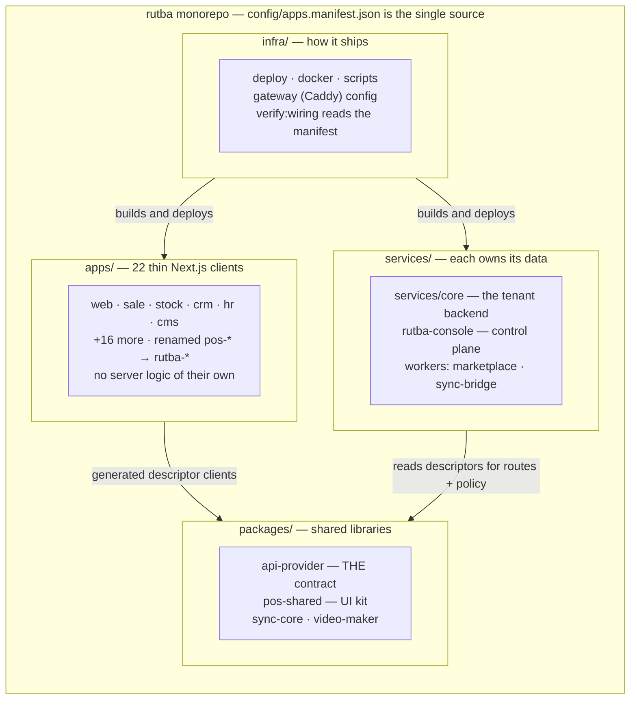
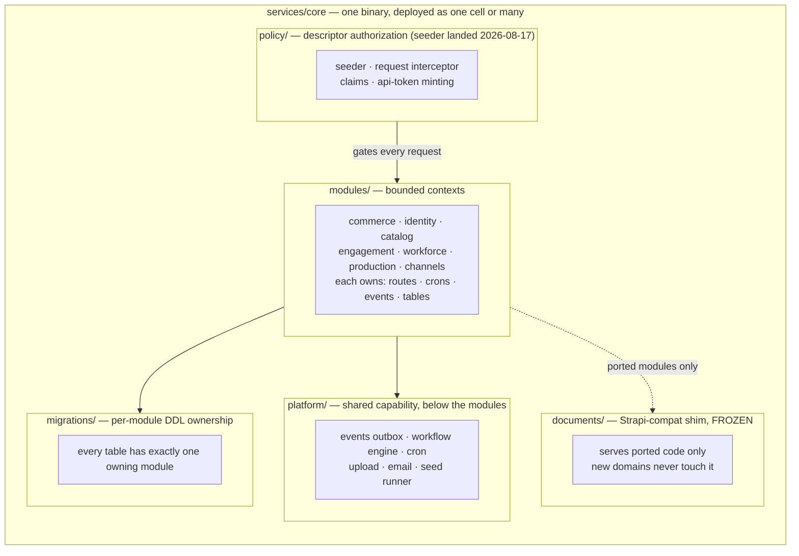
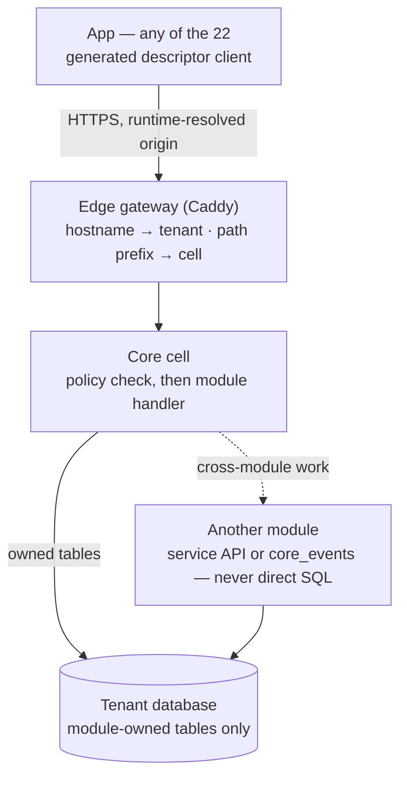
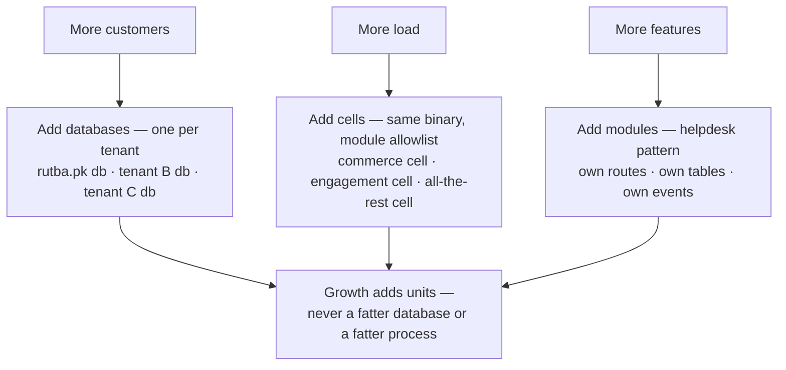

# ERP 2.0 — Architecture Diagrams

Companion to [README.md](README.md). The README decides and sequences; this file draws the
same decisions so they can be pointed at in a review. Diagrams are mermaid (text-diffable,
renders on GitHub) — no binary assets.

Four questions, one diagram each:

1. [How the code is structured](#1-how-the-code-is-structured) — the repo after P3
2. [What is inside the core](#2-what-is-inside-services/core) — modules, platform, policy
3. [How the apps connect](#3-how-an-app-reaches-its-data) — one request, end to end
4. [How growth is absorbed](#4-how-growth-is-absorbed) — the anti-monolith mechanisms

---

## 1. How the code is structured

Four groups, one manifest. Today's ~25 top-level directories collapse into a tree where
**placement tells you what a thing is**. The manifest half is already live:
[config/apps.manifest.json](../../../config/apps.manifest.json) has been the single source for
key, unit, port, domains, category and workspace path since 2026-08-17, and
[verify-app-wiring.js](../../../scripts/js/verify-app-wiring.js) hard-fails on any surface that
disagrees with it. P3 moves the directories to match.



Target tree — the P3 deliverable:

```
rutba/
├── config/apps.manifest.json     ← single source: key, port, domain, category, path
├── apps/                         ← 22 Next.js clients, dir name == app key
│   ├── web/  sale/  stock/  crm/  hr/  cms/  …
│   └── (each: pages only — data access via generated clients)
├── services/
│   ├── core/                     ← services/core: modules, platform, policy, migrations
│   ├── console/                  ← control plane (own DB, never a tenant's)
│   └── workers/{marketplace,sync-bridge}/
├── packages/
│   ├── api-provider/             ← descriptors → clients + authorization policy
│   ├── shared/  sync/  video/
└── infra/{deploy,docker,scripts}/
```

**Why this shape.** The apps are already healthy thin clients — 19 of 22 have no server-side
surface at all — so 2.0 does not rewrite them; it stops them from being *misfiled*. The three
that do have server code (`web`'s NextAuth, `social`'s media proxy, `marketplace`'s 19 routes
+ worker) are exactly the ones whose server halves move to `services/` where their lifecycle
and deploy story belong.

---

## 2. What is inside services/core

One binary. The internal layering is what keeps it from becoming the next monolith: modules
are bounded contexts that own their surface end to end, and everything shared sits *below*
them as platform, never *between* them as a grab-bag.



| Layer | Rule that keeps it honest |
|---|---|
| `modules/` | A module owns its routes, crons, event subscriptions and tables. It may **read** another module's data, but may only **write** through that module's service API or `core_events`. |
| `platform/` | Capability shared by all modules (outbox, workflow, cron, upload, email). Modules depend on platform; platform never depends on a module. |
| `policy/` | Descriptors stay the single source of authorization truth. The [seeder](../../../services/core/src/policy/seeder.js) and api-token minting landed 2026-08-17, so a descriptor edit reaches the route table with no Strapi process alive — see [02-policy-seeder-port.md](02-policy-seeder-port.md). |
| `documents/` | Frozen compat shim. It exists to keep ported code alive, and stops growing — new domains are core-native ([README](README.md) decision D5). |
| `migrations/` | Per-module DDL. This is what makes a later physical table move a config change instead of an archaeology project. |

---

## 3. How an app reaches its data

One path, no exceptions. Every one of the 22 apps talks to its backend the same way, which is
why the backend can be reshaped underneath them without touching app code.



Four properties this path buys:

- **The descriptor is the contract.** The app calls a generated client; the same descriptor
  file seeds the authorization policy the cell enforces. Client and server cannot drift,
  because they are generated from and seeded from one source.
- **The origin is runtime, not baked** (P2's first task). Today `NEXT_PUBLIC_API_URL` is
  compiled into all 22 apps, so a backend change is a full-monorepo rebuild. After P2 it is
  config + restart — and the same change is what lets one shared frontend deployment serve
  every tenant.
- **Tenant comes from the request, never a parameter.** The gateway resolves it from the
  hostname; no endpoint accepts a tenant id, so no bug can cross tenants.
- **Cross-module writes are visible.** They go through a service API or the event outbox,
  which means the boundary can be validated in CI rather than trusted.

---

## 4. How growth is absorbed

The anti-monolith mechanisms, one per growth pressure. In each case the response adds a
*unit* rather than enlarging an existing one.



| Pressure | Response | What stops the old failure mode |
|---|---|---|
| More customers | One database per tenant | No table ever accumulates all customers. A hot tenant moves to its own hardware without touching anyone else; backup, restore and offboarding are per-customer operations. |
| More load | More cells of the same binary | `RUTBA_CORE_MODULES` (planned) peels commerce or engagement into their own processes when metrics demand it. The gateway absorbs the change; **no code change** — proven by the P4 gate (the `duo` topology passes the full smoke suite with zero diff vs `single`). |
| More features | A new core-native module | It arrives self-contained (routes, tables, events, migrations) instead of as edits threaded through existing modules. Helpdesk already proves the pattern. |
| Platform capability | A standalone service | Media, mail transport, control plane and sync each keep their own store — the recorded standalone-service convention, not new tables in the tenant DB. |

### The deliberate exception

**Commerce never splits internally.** Sale, stock, payment, cash-register, order-management
and GL stay in one cell permanently, because every mutation funnels through the workflow
engine's `executeTransition` and shares transactions. That is a floor in the design, not
leftover monolith — splitting it would buy sagas and two-phase commits, not growth.

### Why this survives contact with reality

Each rule above has a mechanism, not just a convention:

| Rule | Enforced by |
|---|---|
| Every table has one owning module | Boundary validator (P3) fails any cross-module write outside `core_events` or the owning service |
| The compat shim stops growing | New domains are core-native by convention + review; the shim gains no new call sites |
| Coverage claims are measurable | [route-audit.js](../../../services/core/scripts/route-audit.js) NOT_PORTED = 0 and [descriptor-audit.mjs](../../../services/core/scripts/descriptor-audit.mjs) exit 0 |
| Registries cannot drift | [verify-app-wiring.js](../../../scripts/js/verify-app-wiring.js) hard-fails against the manifest — live since 2026-08-17 |
| Splitting is evidence-based | P0 baseline metrics (boot, RSS, p95, cron runtimes) rerun per topology in P4 |
| Docs match the tree | [verify-docs.js](../../../scripts/js/verify-docs.js) — this file included |
