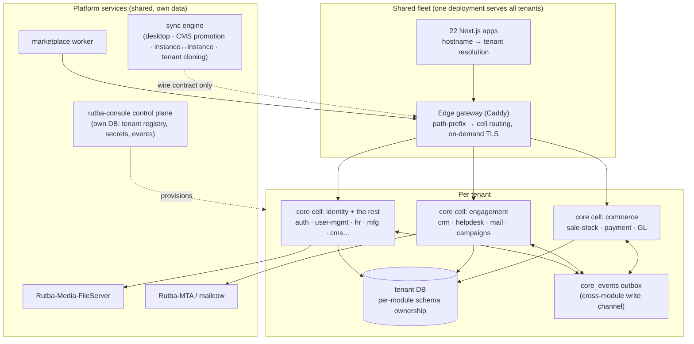
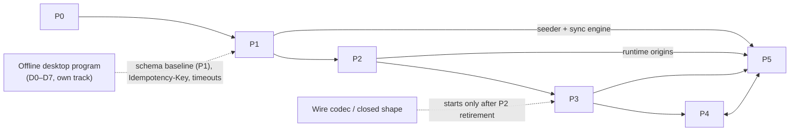

# Rutba ERP 2.0 — Execution Program

Status: **program plan — v2, 2026-08-18.** Umbrella program. Detailed specs stay in their
own program folders; this document decides the decomposition model, resolves the recorded
contradictions between programs, and sequences everything into one launchable release.

> **v2 changed the sequence.** P3's tree-move ran early by owner decision, and the estate is
> now split — `dev` carries the rename, the deploy boxes do not. **[§3a](#3a-where-the-program-actually-stands--reworked-sequence-2026-08-18)
> has the current standing and the reworked order; read it before the phase list below**, which
> still reads in the original P0→P5 sequence.

<!-- verify-docs: planned services/core/src/modules/campaigns.js services/core/src/modules/mail.js services/core/migrations/000-baseline-schema.js infra/** scripts/contract-tests/** docs/contracts/** -->

**What "2.0" means, in one sentence per axis:**

| Axis | 1.x today | 2.0 |
|---|---|---|
| Backend | Strapi (`services/strapi`) + strangler (`services/core`) side by side on one DB | **Strapi-free**: `services/core` only; `services/strapi` archived |
| Services | one backend process serves every domain | **cells**: the same core binary deployable per module-bundle behind the gateway |
| Data | one MySQL database (`pos_db`) for everything | split on **three axes**: per-tenant DBs, platform-service DBs, per-module schema ownership inside the tenant DB |
| API | Strapi REST envelope, long-form query surface | same descriptor contract, served by core; closed-shape wire codec as the hardened public surface |
| Repo | 25 top-level app dirs + 2 out-of-workspace backends + 8 hand-synced registries | regrouped `apps/` / `services/` / `packages/` / `infra/` generated from **one manifest** |
| Tenancy | rutba.pk single-tenant | control plane + provisioned tenants, rutba.pk as ring-0 tenant #1 |

Reading order for the impatient: **P0–P1 finish the engine, P2 kills Strapi, P3 cleans the
house, P4 opens the throttle, P5 sells it.** Phases overlap where §4 says they can.

Drawn version of §2's decisions — repo layout, core internals, the request path, and the
anti-monolith mechanisms: **[00-architecture-diagrams.md](00-architecture-diagrams.md)**.

---

## 1. Ground truth (measured 2026-08-17)

What actually exists, from a fresh sweep of the tree — several program READMEs are stale and
understate their own progress (fixing them is a P0 task).

### 1.1 The estate

- **22 Next.js apps** (all pages-router), **2 backends**, **1 worker**, **6 shared packages**.
  19 of 22 apps are pure browser clients of `@rutba/api-provider`; only three have server-side
  surface: `apps/content/storefront` (NextAuth + SSR), `apps/content/social` (media byte-proxy), and
  `apps/sales/marketplace` (19 API routes + a standalone worker that talks to Strapi directly with a
  service token).
- **One MySQL 8 database (`pos_db`) shared by both backends** — [core-server ground rule 2](../core-server-multitenancy-program/README.md)
  ("same database, exclusive write paths"). No Postgres, no SQLite in deployment.
- **Service registry:** [scripts/rutba_apps.sh](../../../scripts/rutba_apps.sh) — 25 systemd
  units, ports 4000–4023 (strapi 4010, core 4020), plus the `RUTBA_BACKEND=strapi|core|both`
  strangler switch and its validator.
- **Registry drift is real:** adding an app touches ~8 surfaces (registry, root `package.json`
  scripts, `.env.*`, [roles.js](../../../packages/shared/lib/roles.js) `APP_URLS`/`VALID_APP_KEYS`,
  [domains.json](../../../packages/api-provider/config/domains.json), `Dockerfile` targets,
  `docker-compose.yml`, `dev-start.bat`) and today five of them disagree in small ways.
- **Dead weight — purged 2026-08-17:** `rutba-users/` (stale `.next/` only),
  `src/hooks/useErrorHandler.ts` (orphaned at repo root; apps/content/storefront has its own copy), dead
  `RUTBA_USERS__PORT` / `NEXT_PUBLIC_USERS_URL` env entries, and the
  `packages/api-provider/temp/` scratch files are gone. Still open in
  [tech-debt-cleanup.md](../tech-debt-cleanup.md): §3 swiper (needs component migration first).
  <!-- verify-docs: removed rutba-users/ -->

### 1.2 The strangler is nearly done building — and not started flipping

Workstream B ([core-server-multitenancy-program](../core-server-multitenancy-program/README.md))
is much further along than its README's phase table implies:

- **All 8 tranches ported and smoke-verified** (playbook steps 1–4), plus four modules with no
  tranche sheet at all: `catalog`, `helpdesk` (core-native), `uploads`, `user-mgmt`. Twelve
  modules in [services/core/src/modules/index.js](../../../services/core/src/modules/index.js), ≈505
  custom routes mounted.
- **Content-type coverage is 100% by construction** — the schema registry loads every
  `services/strapi/src/api/*/content-types/*/schema.json` at boot; the real axis is custom actions.
- **Still Strapi-only** (custom actions answer 501 on core): the campaigns cluster
  (`cmp-campaign`, `cmp-run`, `cmp-sending-identity`, `cmp-template`, `cmp-audience`),
  `mail-message`/`mail-link` actions, the `media` api dir, and `/api/content-sync/*`
  (calls `strapi-content-sync-pro`, which core's compat layer cannot load). Mail and campaigns
  crons have no core home.
- ~~**The hardest residual dependency:** the api-pro descriptor seeder runs only inside
  Strapi~~ — **closed 2026-08-17.** Core's route table is still read from
  `api_pro_interfaces`/`api_pro_interface_methods`, but
  [services/core/src/policy/](../../../services/core/src/policy/) now writes those tables itself
  (and mints API tokens), so a descriptor change no longer needs a Strapi process. See
  [02-policy-seeder-port.md](02-policy-seeder-port.md).
- **Runtime coupling:** 9 core files `require()` from `services/strapi/node_modules`
  (auth validators, `@strapi/utils`, nodemailer, `@strapi/upload` image manipulation), and the
  schema loader reads `schema.json` from the services/strapi tree. Even at `RUTBA_BACKEND=core`,
  services/strapi's source tree must be deployed.
- **Core cannot create its own base schema** — measured in
  [05-sqlite-viability.md](../offline-desktop-program/05-sqlite-viability.md): the only
  `createTable` in core's source is the migrations ledger. Core derives and validates a schema
  Strapi built ([validate-schema.js](../../../services/core/scripts/validate-schema.js): 140 entity /
  314 link / 15 component tables, zero diffs), but cannot bootstrap one.
- **Dev already runs on core**: `.env.development` points `NEXT_PUBLIC_API_URL` at port 4020;
  the LAN box runs `RUTBA_BACKEND=both` with core baking.
- Playbook **steps 5–8 are open for every tranche**: no goldens on a fixture DB, no schema
  handover, no production flip, no deletion from Strapi.

Workstream A (control plane, tenant-aware frontends, fleet ops) is **specified and at zero
build**, as are the six admin-console sections beyond the A0 rekey.

### 1.3 What core already has that Strapi never did

These are 2.0's platform spine, already in the tree:

- [services/core/src/platform/events.js](../../../services/core/src/platform/events.js) — transactional
  outbox domain-event bus (`core_events`/`core_event_deliveries`, at-least-once, per-aggregate
  ordering, dead-letter + replay). The offline program's replayer and the sync engine both reuse
  it by decision.
- [services/core/src/platform/workflow.js](../../../services/core/src/platform/workflow.js) — the
  configurable state machine that owns order/stock side effects.
- Core-native module pattern: `services/core/src/domain/helpdesk/` + knex migrations in
  [services/core/migrations/](../../../services/core/migrations/) — services/repos/policies with no
  Strapi shapes at all. **This is the go-forward style for every new domain.**
- Coverage instrumentation: [descriptor-audit.mjs](../../../services/core/scripts/descriptor-audit.mjs)
  and [route-audit.js](../../../services/core/scripts/route-audit.js) make "what still 501s" a
  number per app, and [contract-diff.js](../../../services/core/scripts/contract-diff.js) + 17
  `smoke-*.js` scripts are the de-facto contract harness.
- [packages/sync](../../../packages/sync/README.md) — offline bridge phase 1
  (pass-through proxy), the seed of the one sync engine.

---

## 2. Target architecture

### 2.1 The decomposition unit is the module bundle, not the entity

The user-facing goal is *coherent independent applications with independent data*. The naive
reading — one microservice + one database per domain entity — is explicitly **rejected** here,
for reasons this repo has already paid to learn:

1. **The transactional core is one thing.** Sale, stock, payment, cash-register, order
   management and GL migrated as a single tranche
   ([tranche-7](../core-server-multitenancy-program/tranche-7-sale-stock-gl.md)) because every
   mutation funnels through `executeTransition` and the stock invariants. Splitting them across
   network boundaries buys sagas and two-phase commits, not growth.
2. **Tenancy multiplies whatever we deploy.** The decided model is database-per-tenant with a
   per-tenant backend ([ground rule 4](../core-server-multitenancy-program/README.md)). N
   domain-services × M tenants of Node processes is the exact cost curve the shared frontend
   fleet decision exists to avoid.
3. **The boundaries already exist as code.** A core module registers `{ name, routes }`,
   its own crons, lifecycles and event subscribers. The route table knows which module owns
   every path. That is a service boundary in all but process placement.

So 2.0's shape is: **one core binary, deployable as many "cells".** A cell is a core process
started with a module allowlist (planned `RUTBA_CORE_MODULES=...`), serving only its modules'
routes, with the gateway (Caddy) routing path-prefixes to cells. One tenant can run as one cell
(today's shape, and the default for small tenants) or as several (scale shape) — **without any
code change, because the boundary is enforced logically at all times** (§2.3). Microservices
become a *deployment decision per tenant*, not an architecture rewrite.

### 2.2 Service map

| Cell / service | Modules (today's names) | Data it owns | Deploy unit |
|---|---|---|---|
| **identity** | `auth`, `user-mgmt` | `up_users`, `strapi_sessions`, api-pro claim tables | core cell |
| **commerce** | `sale-stock` (sale, stock-item, payment, cash-register, order-mgmt, `acc-*` GL) | orders, stock, payments, ledgers | core cell — never split internally |
| **catalog & content** | `catalog`, `cms-social`, `uploads` | products, CMS pages, media rows, social posts | core cell |
| **engagement** | `crm`, `helpdesk`, `mail`, `campaigns` (last two: P1 ports) | contacts, tickets, mail links, audiences | core cell |
| **workforce** | `hr` (hr, payroll, ess, work-item) | employees, attendance, payroll runs | core cell |
| **production** | `mfg`, `inventory` | BOMs, work orders, lots, reorder rules | core cell |
| **channels** | `marketplace` module + worker process | listings, channel accounts, sync state | core cell + worker |
| **control plane** | `rutba-console` (planned, Workstream A) | tenant registry, domains, secrets, tenant events — **own DB, never in a tenant DB** | standalone app |
| **media** | Rutba-Media-FileServer (external repo) | file bytes, variants | standalone service |
| **mail transport** | Rutba-MTA / mailcow (external) | queues, mailboxes | standalone service |
| **sync** | `packages/sync` + core `content-sync` module (planned) | outbox cursors, manifests | library + bridge process |

Cell groupings are **configuration, not commitments** — the enforced boundary is the module.
The starting topology for every tenant is all modules in one cell; splitting is a scaling
response, guided by the baseline metrics P0 starts recording.

### 2.3 Data: three split axes, in this order

1. **Tenant axis (decided, absolute):** database-per-tenant, forever. Isolation, backup,
   offboarding, data residency. This is the split that actually carries "exponential growth":
   tenants scale horizontally by construction, and a hot tenant can be moved to its own
   hardware without touching anyone else.
2. **Platform axis (mostly done, finish it):** control-plane DB, media server, MTA, sync state,
   analytics-when-it-exists — each its own store, never inside a tenant DB. This is where the
   "split the monolithic database" ask is genuinely correct and cheap.
3. **Domain axis inside a tenant (logical now, physical on evidence):** after schema handover
   (P2), every table is owned by exactly one module's migrations; cross-module **writes** go
   through the owning module's service/API or `core_events` — never direct table access. A
   validator enforces this (P3). Once that holds, physically moving a module's tables to
   another schema or server is a knex-pool config change, not a rewrite. We do it when a
   measured trigger fires (lock contention, table growth, divergent scaling needs), not
   before. **Premature physical splits inside the tenant are an anti-goal (§6).**

### 2.4 API

- **The descriptor contract is the API.** `packages/api-provider/api/*.js` remains the single
  source for routes, clients, and authorization policy — unchanged through the whole program
  ([plugin-replacement-map](../core-server-multitenancy-program/06-plugin-replacement-map.md):
  any migration step that wants a descriptor shape change is a red flag).
- **The gateway is the seam.** Caddy path-handles route per module prefix — first used for
  per-tranche cutover (P2), then permanently for cell routing (P4).
- **The closed-shape wire codec** ([project_api_provider_wire_codec.md](../project_api_provider_wire_codec.md))
  becomes 2.0's hardened public surface — but is **sequenced strictly after Strapi retirement**
  (decision D6, §5), resolving its recorded conflict with the strangler's contract freeze.
- **Coverage is a number, not a claim:** `descriptor-audit.mjs` exit-0 and `route-audit.js`
  NOT_PORTED=0 are the gates that phrases like "core serves everything" must cash out to.

### 2.5 Eventing

`core_events` is the only sanctioned cross-module write channel besides the owning module's
API. When cells split (P4), the dispatcher constraint recorded in
[01-sync-core.md](../offline-desktop-program/01-sync-core.md) (exactly one dispatcher per
event stream) is honored by partitioning: each cell dispatches only events whose aggregate its
modules own. That keeps per-aggregate ordering without a broker. A real broker is a P4+
option, adopted only if fan-out measurements demand it.

---

## 3. Phases

Effort sizes are focused-work estimates for this codebase's actual velocity (solo + agents),
not calendar promises. Gates are all mechanically checkable.

### P0 — Truth and baseline (~1–2 weeks)

Cheap, unblocking, and mostly overdue.

- [ ] **Fix stale program docs**: core-server README phase table (understates Workstream B),
      offline-desktop README ("nothing is built" vs shipped `packages/sync`; bridge host
      is a UtilityProcess), `services/core/README.md` status block, superseded tenancy language in
      [market-strategy](../market-strategy/README.md) / [rightapp-gap-analysis](../rightapp-gap-analysis/README.md).
- [ ] **Record baseline metrics** (the never-done item from
      [01-contracts-freeze.md](../core-server-multitenancy-program/01-contracts-freeze.md)):
      boot time, RSS, p95 on the top-20 routes, cron runtimes — for both backends. Without
      this, neither the core win nor future fleet regressions are provable.
- [ ] **Adopt the contract harness formally**: declare `contract-diff.js` + `smoke-*.js` the
      official Phase-0 mechanism (supersede the unbuilt `docs/contracts/` +
      `scripts/contract-tests/` corpus in place), and add a fixture-DB golden run per tranche
      to close playbook step 2.
- [x] **One app manifest** (2026-08-17): [config/apps.manifest.json](../../../config/apps.manifest.json)
      is the single source for key, unit, port, domains, category and workspace path, and
      [verify-app-wiring.js](../../../scripts/js/verify-app-wiring.js) hard-fails on any surface
      that disagrees. `verify:wiring` went from 9 errors to 25/25 wired; the
      [drift report](01-registry-drift-report.md) records what was accidental (fixed) versus
      deliberate (now declared as flags). Presentation stays in `APP_META` until the admin console
      serves the catalogue per tenant.
- [x] **Dead-code purge** (2026-08-17): deleted `rutba-users/`, the root
      `src/hooks/useErrorHandler.ts` stray, dead env keys, and the api-provider `temp/`
      scratch files; [tech-debt-cleanup.md](../tech-debt-cleanup.md) §5 closed. §3 (swiper)
      deferred — three apps/content/storefront components still import it.

**Exit gate:** `npm run verify:wiring` and `npm run verify:docs` green with the manifest live;
baseline numbers committed to the program folder.

### P1 — Close the Strapi gaps (~4–6 weeks; parallelizable)

Everything that still *requires* a running Strapi, enumerated and killed.

- [x] **Port the api-pro seeder** (2026-08-17): [services/core/src/policy/](../../../services/core/src/policy/)
      seeds the `api_pro_*` tables straight from the descriptor contract, so a descriptor edit
      reaches the route table with no Strapi process alive. It diffs instead of upserting
      (`--dry-run` prints the plan; the steady state writes nothing), reports rows no descriptor
      declares any more, and preserves admin-tuned policies. API-token **minting** ships with it.
      Proven by seeding a from-scratch copy of the live tables inside a rolled-back transaction
      and comparing: 6,359 rows and 6,163 links reproduced exactly, 44/44 checks
      ([scripts/smoke-policy.js](../../../services/core/scripts/smoke-policy.js)). It also surfaced
      54 stale rows — including 4 grants the contract had already revoked. Full write-up:
      [02-policy-seeder-port.md](02-policy-seeder-port.md).
- [ ] **Port the remaining custom actions**: campaigns cluster + campaign cron
      (`services/core/src/modules/campaigns.js`, planned), `mail-message`/`mail-link` actions +
      mail cron (`services/core/src/modules/mail.js`, planned), the `media` api dir routes.
- [ ] **Build the sync engine v1** (replaces `strapi-content-sync-pro`): contract-level,
      per the decided design in [06-plugin-replacement-map.md](../core-server-multitenancy-program/06-plugin-replacement-map.md)
      — manifest per connection, CMS `documentId` identity, commerce `external_ids.<origin>`
      identity, `updatedAt` cursor + tombstones. Close the open gaps in
      [cms-sync/plugin-gaps.md](../cms-sync/plugin-gaps.md). Mount as core module
      `content-sync` (planned) + grow `packages/sync`. One engine, four consumers
      (desktop, CMS promotion, instance↔instance, tenant cloning).
- [ ] **Re-home the remaining Strapi-admin screens** (the standing "no Strapi-admin
      extensions" rule): api-pro Policy Editor → `apps/admin/console`; API-token issuance →
      `apps/admin/console`; core-store settings (email templates, reset-URL) → `apps/admin/console`;
      raw content browse/edit fallback → the owning domain apps (apps/content/cms already covers CMS;
      CRM/stock cover theirs). Decide-by-list: anything still used monthly gets a home or an
      explicit "dies with Strapi" entry.
- [ ] **Parity punch-list**: `/me/permissions` `role: null`; inverse-side relation writes;
      password-reset mail flow (tranche-8 deviation); seeding engine runs under
      `RUTBA_BACKEND=core` (today `rutba_seed.sh` hard-skips — move the registry/engine into
      core or run it through core's documents shim).
- [ ] **Vendor the runtime couplings**: the 9 files requiring from `services/strapi/node_modules`
      get direct deps in `services/core/package.json` (bcryptjs, nodemailer, yup schemas,
      `@strapi/utils` session helpers, upload image-manipulation — fork-lift the last two if
      needed); schema loader keeps reading `schema.json` but from a path that survives
      services/strapi's removal (P2 moves the files).
- [ ] **Schema self-hosting, step 1** (shared with the offline program): CI job boots
      services/strapi once against an empty SQLite file and publishes it as the replica/tenant
      baseline (option A from [05-sqlite-viability.md](../offline-desktop-program/05-sqlite-viability.md)),
      gated on making `validate-schema.js` SQLite-aware.

**Exit gate:** `route-audit.js` NOT_PORTED = 0; `descriptor-audit.mjs` exit 0; a descriptor
edit → seed → serve cycle completes with **no Strapi process alive**; sync engine passes the
CMS-promotion smoke; `RUTBA_CORE_EMAIL=send` covers every mail the system sends.

### P2 — Cutover and Strapi retirement (~6–10 weeks elapsed, bake windows included)

The strangler's endgame — playbook steps 5–8, per tranche, plus retirement.

- [ ] **Runtime API origin first**: implement
      [03-tenant-aware-frontends.md](../core-server-multitenancy-program/03-tenant-aware-frontends.md)'s
      origin resolution (server-provided config over baked `NEXT_PUBLIC_API_URL`) *before* the
      flips, so a backend cutover becomes config + restart instead of a 22-app rebuild. This is
      also a hard prerequisite for the tenant fleet (P5) and the desktop shell — build once.
- [ ] **Per-tranche flip sequence** (low-risk first, commerce last):
      goldens recorded → schema-handover migration (core-owned baseline for that module's
      tables) → gateway path-handle flips to core → 1–2 week bake with revert-by-route-flip →
      routes deleted from services/strapi, zero-copy sources moved (`git mv`) into
      `services/core/src/modules/` ownership. Crons single-home at each flip (`RUTBA_CORE_CRONS`
      discipline per [tranche-4](../core-server-multitenancy-program/tranche-4-inventory.md)).
      Order: mfg → hr/payroll → crm → inventory → cms-social → marketplace → **auth** (free
      flip via shared `JWT_SECRET` + `strapi_sessions`) → **commerce (tranche 7), last**.
- [ ] **Marketplace worker + apps/content/storefront NextAuth** repointed at core and their service tokens
      minted by core (P1's minting work).
- [ ] **Retirement**, once every tranche has baked:
      - snapshot the live schema into `services/core/migrations/000-baseline-schema.js` (planned)
        — generated **from the database**, not from a second DDL emitter, honoring the
        one-schema-source rule;
      - `git mv` the `schema.json` tree into services/core ownership (registry input, now
        core-owned);
      - `RUTBA_BACKEND=core` everywhere; remove `both` from the registry after one release;
      - archive `services/strapi/` (attic branch + delete from `dev`), retire the
        `strapi-api-pro` plugin wrapper (core's `services/core/src/policy/` is the home) and
        `strapi-provider-upload-media`'s Strapi peer (provider logic lives on in core's
        upload platform);
      - delete `dev:strapi`/`build:strapi`/`start:strapi` scripts, compose services, Caddy
        handles.

**Exit gate:** zero Strapi processes in every environment; `grep -r "services/strapi" services/core/src`
returns nothing; contract smokes green against core-only; one full release cycle (deploy +
rollback drill) executed on the core-only stack.

*Strict-rollout note:* the bake windows deliberately invoke the
[strict-rollout rule](../feedback_strict_rollout_no_warn_phase.md)'s stated exception —
production traffic flips are external coordination. Everything else in this program lands as
single red-to-green sweeps.

### P3 — Repo restructure (~3–4 weeks)

> **Sequencing note (2026-08-18):** this section originally read "starts after P2's retirement,
> not before" — restructuring under a live migration multiplies every conflict. The tree-move
> ran early anyway, by owner decision, as a rehearsal; see [§3a](#3a-where-the-program-actually-stands--reworked-sequence-2026-08-18)
> for what that cost and bought. The remaining items below still sit after P2.

- [x] **Regroup the tree** (2026-08-18), manifest-driven, `git mv` preserving history — **done**:
      [03-repo-restructure.md](03-repo-restructure.md) has the full 27-row mapping,
      [config/apps.manifest.json](../../../config/apps.manifest.json) carries it under `rename`,
      and [scripts/js/restructure.js](../../../scripts/js/restructure.js) executes it in four
      phases. Apps land in `apps/<category>/`, backends in `services/`, and six app keys change
      with them (`sale`→`pos`, `inventory`→`control`, `admin`→`console`, `web`→`storefront`,
      `web-user`→`portal`, `order-management`→`orders`) alongside 17 role keys, which
      [services/core/migrations/022-rename-app-keys.js](../../../services/core/migrations/022-rename-app-keys.js)
      applied to the api-pro rows in the same release — grants survived untouched, because
      `up_users_app_roles_lnk` references `app_role_id` rather than the key. Landed: 2,191
      renames, ~4,900 reference rewrites, 22/22 apps building, `verify:wiring` 25/25,
      `verify:docs` clean, `smoke-policy` 44/44, core booting from `services/core`. The six
      bugs execution found — and the gates that caught each — are recorded in §8 of the
      write-up. Deploy-box env and systemd renames are still owed (§9).
- [ ] **Enforce the module boundary** (the §2.3 domain axis): each core module declares its
      owned tables; a new validator (extending the `validate-schema.js` /
      [route-audit.js](../../../services/core/scripts/route-audit.js) family) fails on any
      cross-module table write outside `core_events` or the owning module's service. Split the
      `catalog.js` grab-bag (76 routes) into its real homes as part of this.
- [ ] **Codify the core-native convention**: new domains are built helpdesk-style
      (`src/domain/<name>/` + knex migrations + descriptors), never as new `schema.json`
      content-types. The documents() shim is for ported code; it stops growing.
- [ ] Finish the deferred cleanups now cheap: retire `providers/createClientProxy.js` and the
      `api-provider/pos` tree (named-policy follow-ups #7/#8), the `endpoints/` legacy entry,
      and the deprecated `users` app-domain alias
      ([packages/api-provider/api/users.js](../../../packages/api-provider/api/users.js) +
      [domains.json](../../../packages/api-provider/config/domains.json) — the two services/strapi
      touchpoints disappear with P2's retirement).

**Exit gate:** `verify:wiring` green from the manifest alone; boundary validator green;
a new-app scaffold (manifest entry → running app) takes one command and touches one file by
hand.

### P4 — Cell decomposition (~4–6 weeks, overlaps P5)

The "microservices" payoff, as configuration on the P2/P3 foundation.

- [ ] `RUTBA_CORE_MODULES` allowlist (planned) in the module registry: a cell mounts only its
      modules' routes + their crons + their event subscriptions; everything else 404s at the
      gateway, which routes path-prefixes per the §2.2 map.
- [ ] **Dispatcher partitioning**: each cell dispatches only its own aggregates' events
      (§2.5); a shared-nothing check at boot refuses two cells claiming one module.
- [ ] **Reference topologies shipped as config**: `single` (everything, default),
      `duo` (commerce | rest), `full` (§2.2 map) — with the P0 baseline metrics rerun per
      topology so splitting is always an evidence-backed choice.
- [ ] **Physical DB moves, only on trigger**: documented runbook — module's tables → separate
      schema/server, knex pool repointed, boundary validator proves no stragglers. No move is
      scheduled; the capability is the deliverable.

**Exit gate:** the `duo` topology serves the full contract smoke suite on a staging tenant
with zero code changes relative to `single`.

### P5 — Multitenancy and the 2.0 launch (~8–12 weeks, overlaps P4)

Workstream A, the admin console program, and the launch itself.

- [ ] **Control plane** (`rutba-console`, planned; own DB): tenant registry
      (`tenant`/`tenant_domain`/`tenant_secret`/`tenant_event`), the 8-step idempotent
      provisioning pipeline (target < 5 min: DB → secrets → schema from the P2 baseline
      migration → seed packs → media namespace → gateway routing → launch cell(s) →
      contract-smoke), per [02-control-plane.md](../core-server-multitenancy-program/02-control-plane.md).
- [ ] **Tenant-aware fleet**: `resolveTenant(host)` in the shared frontends (P2 already
      delivered runtime origins), per-tenant JWT secrets, Caddy on-demand TLS keyed to the
      registry.
- [ ] **Multi-DB core**: one core process (or cell set) holding per-tenant knex pools and
      per-tenant api-pro claim caches (the T5 fix — cache keyed by tenant, not just user).
      This is the hosting-margin endgame from
      [04-core-server-and-shim.md](../core-server-multitenancy-program/04-core-server-and-shim.md).
- [ ] **Admin console sections that gate sale-ability**:
      A1 app catalogue + entitlements (prerequisite for per-tenant app sets on a shared
      fleet — the inverted dependency), A2 credential vault (**security clock**: four token
      entities are plaintext at rest today), A6 grant-vs-state reconciliation
      (`installed`/`enabled`/`isActive`), per
      [admin-console-program](../admin-console-program/README.md).
- [ ] **Billing & quotas spec** — the one wholly unwritten piece. Market strategy fixes the
      shape (branch/site-based, AI included); metering = branches + storage + mail volume,
      enforced softly first. Write it as `erp2-program` doc 02 when P5 starts.
- [ ] **Launch sequence**: migrate rutba.pk onto tenant infrastructure as ring-0 tenant #1 →
      provision a demo tenant from seed packs + sync-engine content promotion → onboard one
      real external tenant on a paid plan → upgrade-ring discipline live (nightly per-tenant
      dumps, restore drill passed).

**Exit gate = the 2.0 launch definition (§7).**

---

## 3a. Where the program actually stands — reworked sequence (2026-08-18)

P3's tree-move **ran early, out of order, and deliberately** — as a rehearsal, at the owner's
direction, while Strapi is still live. D8 said the restructure waits for retirement; that
decision was consciously overridden rather than forgotten, and D8 below is amended with what
the override cost and bought. The rest of P3 (module boundary, core-native convention, deferred
cleanups) is untouched and still sits after P2.

**What it cost.** P2's checklist is now written against paths that no longer exist — the
per-tranche `git mv` of zero-copy sources, the `schema.json` handover and the archive step all
name `pos-strapi`/`rutba-core`. Re-path P2 before executing it. Three in-flight branches had to
be rename-merged, which turned out cheap: git's directory-rename detection placed modified files
correctly and flagged every added file with the exact relocation.

**What it bought, and this is the part that changes the sequencing.** The rehearsal surfaced
eight execution findings (§8 of [03-repo-restructure.md](03-repo-restructure.md)), two of which
would have broken production silently — every app announcing a dead `X-Rutba-App` identity, and
every app losing its env block behind a fully green build. Those are *identity-plumbing* failures,
and P2's tranche flips are one long identity-plumbing exercise. Finding them now, against a
rehearsal instead of a live cutover, is a real de-risking of P2. The gates that came out of it
(`verify:wiring`'s announced-identity check, manifest-derived env resolution) now guard the flips.

### What 2026-08-18 added to Item 0

Starting Strapi on this machine, a day after the move, **dropped 13 `api_pro_*` tables and the
user→role grants** — a dangling `file:` symlink npm wrote mid-move meant the plugin never loaded,
and Strapi's schema sync deletes tables no plugin claims (finding 9 in
[03-repo-restructure.md](03-repo-restructure.md)). The contract rows came back exactly from
`seed:policy`; the grants did not come back at all.

Two consequences for the sequence below, both now folded into the runbook as its **§0**:

- **`npm ci` and `verify:wiring` run on each box before the first `systemctl start`.**
  `verify:wiring` now fails on a dangling `file:` dep for exactly this reason.
- **Dump the database before the first Strapi start on each box.** Local grants were a dev
  inconvenience; on the LAN box or the VPS they are real, and no seeder can regenerate them.

It also settles a question the plan had left open. P1's seeder was justified as *"a descriptor
edit reaches the route table with no Strapi process alive"*. Its first real use was disaster
recovery — rebuilding 6,347 rows an accident had deleted, verifiably, in seconds. That is a
stronger argument for finishing P1 than the one originally written down.

### Item 0 — Operationalize the rename. Blocks everything.

**The estate is currently split.** `dev` carries a whole-tree rename; the LAN box and the VPS do
not. Neither can deploy from `dev` until its env and units are converted — apps would come up
with no env block. `main` is 21 commits behind and deliberately held there for the same reason.

This is the same failure this session kept finding, one level up: *the repo half moved and the
other half did not.* It is item zero, ahead of all phase work, because every phase below is
unshippable until it closes.

- [ ] LAN box (`rutba-nvr@192.168.0.46`): [03a-deploy-runbook.md](03a-deploy-runbook.md) §1 (env,
      via `scripts/js/rename-env-prefixes.js --write`) and §2 (nine systemd units), then a deploy.
- [ ] VPS (rutba.pk): same, in a scheduled window.
- [ ] Level `main` to `dev` once both boxes serve from the new tree.

**Gate:** `rename-env-prefixes.js <master env>` prints `already current` on both boxes;
`systemctl list-units "rutba_*"` shows only new names, all active; one deploy **and one rollback
drill** completed on each.

### Then, in this order

1. **Close P0** — baseline metrics (the last open item, and now overdue twice over). Measure on
   the new tree, both backends. Nothing else makes P2's "core win" provable, and it is the only
   defence against fleet regressions in P5. Then adopt the contract harness formally: P2's
   per-tranche goldens depend on it, so it is a P2 prerequisite, not P0 housekeeping.
2. **P1, resequenced smallest-blocker-first** so the long pole starts in parallel:
   vendor the 9 runtime couplings (hard blocker for deleting `services/strapi`) → parity
   punch-list → remaining custom actions (campaigns, mail, media) → re-home the Strapi-admin
   screens (cheap decide-by-list triage first). **Start the sync engine immediately and in
   parallel** — it is the long pole and gates four consumers, not just this program.
3. **P2**, re-pathed, and keep *runtime API origin* as its first item: it converts every
   subsequent flip from a 22-app rebuild into config + restart, and it is a hard prerequisite for
   both P5 and the desktop shell. Then tranche flips, then retirement.

P3's remaining items fold into P2's per-tranche ownership moves, where the module-boundary
validator has something real to enforce. One of them is already done: the deprecated `users`
app-domain alias was removed during the restructure.

---

## 4. What runs in parallel

- **Offline desktop** ([offline-pos-options.md](../offline-pos-options.md) +
  [program folder](../offline-desktop-program/README.md)) proceeds on its own track; it shares
  P1's schema-baseline work and the server prerequisites
  ([04-server-prerequisites.md](../offline-desktop-program/04-server-prerequisites.md)), and
  its bridge becomes just another consumer of the P1 sync engine.
- **Campaigns/mail feature work** continues freely — on core once P1 lands their modules.
- **Helpdesk frontends**, ROADMAP H0 items (FBR, digital payments) are product tracks; they
  ride on whatever backend serves them and are not gated by this program, except that FBR's
  deferred-fulfilment QR intersects the offline track as already recorded.

Suggested overall sequence if strictly serialized: **P0+P1 ≈ 6 wk → P2 ≈ 8 wk → P3 ≈ 4 wk →
P4+P5 ≈ 12 wk** — roughly 7–8 months of focused work to a launchable 2.0, with product work
continuing throughout on the same trunk.

---

## 5. Decisions this program records

| # | Decision | Rationale / what it resolves |
|---|---|---|
| D1 | **Cells over entity-microservices** — decomposition unit is the core module bundle; process placement is per-tenant configuration | §2.1; keeps the transactional core whole; composes with DB-per-tenant economics |
| D2 | **Three data-split axes in order** (tenant → platform → domain-logical; domain-physical only on measured trigger) | §2.3; delivers "split the monolith DB" where it pays, avoids distributed transactions where it doesn't |
| D3 | **Contract harness = `contract-diff.js` + smokes + fixture goldens**, formally superseding the unbuilt `docs/contracts/` corpus | Closes the Phase-0 gap honestly instead of building a parallel mechanism late |
| D4 | **Schema baseline by snapshot, not generator** — retirement freezes the live DB into migration 000; `schema.json` stays the registry input, core-owned | Honors the one-schema-source rule while making core self-bootstrapping |
| D5 | **New domains are core-native** (helpdesk pattern); the documents() shim is for ported code and stops growing | Ends the Strapi-shaped data model without rewriting what works |
| D6 | **Wire codec sequenced after Strapi retirement** | Resolves the recorded conflict with strangler ground rule 1 — one program mutates the descriptor layer at a time |
| D7 | **Bake windows are the strict-rollout exception, invoked explicitly**; everything else is red-to-green sweeps | Resolves the playbook-vs-strict-rollout contradiction on the record |
| D8 | ~~**Repo restructure waits for Strapi retirement**~~ — **overridden 2026-08-18**; the move ran early as a rehearsal, by owner decision. The "rides the manifest" half stands and proved itself | Amended, not deleted: see §3a. The feared cost (merging in-flight work across the rename) was real but cheap — git's directory-rename detection handled three branches. The unforeseen cost was identity drift: eight findings, two of which would have failed silently in production. Finding those against a rehearsal rather than a live cutover de-risks P2, whose flips are the same class of work |

## 6. Anti-goals

- **No row-scoped / column-based tenancy, ever** (tenant-awareness is placement).
- **No per-entity microservices, no physical domain-DB split without a measured trigger.**
- **No rewrite of the 22 frontends** — they are healthy thin clients; only their origin
  resolution changes.
- **No Strapi admin panel rebuild** — screens get homes in rutba apps or die with Strapi.
- **No second sync implementation** — one engine, four consumers; sync never touches a
  database directly.
- **No descriptor shape changes inside P1–P2** (wire codec waits its turn).
- **No off-the-shelf row replicators** (PowerSync/RxDB/Pouch class) — bypassing api-pro claim
  resolution is a security regression, already rejected on the record.

## 7. Launch definition — "Rutba ERP 2.0 is live" when all of these are true

1. Zero Strapi processes in any environment; `services/strapi/` absent from `dev`.
2. A descriptor edit → seed → serve → generated-client cycle runs entirely on core.
3. `route-audit.js` NOT_PORTED = 0, `descriptor-audit.mjs` exit 0, contract smokes green.
4. The repo is manifest-driven (`verify:wiring` green from one source of truth) and regrouped.
5. A new tenant provisions end-to-end in < 5 minutes and passes contract smoke unattended.
6. rutba.pk runs as ring-0 tenant #1 on the tenant infrastructure; nightly per-tenant backups
   with a passed restore drill.
7. The `duo` cell topology passes the full smoke suite on a staging tenant (scale path proven).
8. At least one external tenant is live on a paid plan with the app catalogue and credential
   vault enforcing its entitlements.

## 8. Constituent programs

| Program | Role in 2.0 |
|---|---|
| [core-server-multitenancy-program](../core-server-multitenancy-program/README.md) | Workstreams A & B — the backbone of P1, P2, P5 |
| [admin-console-program](../admin-console-program/README.md) | Tenant-side console; A1/A2/A6 gate the P5 launch |
| [offline-desktop-program](../offline-desktop-program/README.md) | Parallel track; shares P1 schema baseline + sync engine |
| [cms-sync](../cms-sync/plugin-gaps.md) | Gap list the P1 sync engine must close |
| [seeding-roadmap.md](../seeding-roadmap.md) | Seed packs feed tenant provisioning (P5) |
| [market-strategy](../market-strategy/README.md) | Fixes packaging/pricing shape for the billing spec |
| [ROADMAP.md](../ROADMAP.md) | Product horizons riding on this platform program |
